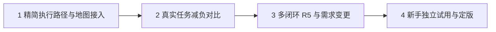

# PAAR-aicoding-lite

面向业务负责人和编程新手的轻量 AI 开发协作机制。目标是让用户说明业务、确认关键取舍和验收结果，由 AI 承担技术分析、实现、验证与记录维护。

**当前为 v0.1 实验原型，正在优化“体系过重”的问题。** 已实现统一规则入口、单一工作记录、记录检查、会话接续说明和只读任务监控地图。尚未证明真实任务效率提升，也没有完成陌生新手独立试用；这不是已经实现全自动开发的产品。

## PAAR 和 R5 分别负责什么

PAAR 是一个具体任务的四步工作法：

| 阶段 | AI 做什么 | 用户需要做什么 |
|---|---|---|
| Plan：计划 | 检查事实，确定最小业务结果、修改范围和验收方式 | 说明需求、补充必要业务背景 |
| Ask：必要澄清 | 只问会改变业务行为、成本、权限或验收标准的问题 | 确认关键取舍；已有授权不重复问 |
| Act：实施 | 小范围修改，保留失败信息和下一步 | 通常无需干预 |
| Review：核验 | 检查实际改动、运行适当验证、展示结果和限制 | 体验并明确确认业务验收 |

Ask 可以没有问题；四阶段不意味着必须有四份文档、四次会议或四次批准。详见 [PAAR 使用方法](docs/paar.md)。

R5 是复杂需求的五阶段方法：**需求分析 → 任务拆分 → 方案与验收约定 → 开发组织 → 整体集成验收**。每个拆出的任务仍用 PAAR 执行。适用判断是“单个任务的验证能否证明整个业务结果成立”；不能时才引入 R5。多个任务各自通过，不代表整条业务链通过。详见 [R5 使用方法](docs/r5.md)。

## 原体系为什么重

原方法有价值：明确边界、减少需求漂移、保留证据、支持接续和集成验收。负担主要来自它的配套执行方式，不能简单归咎于四步或五步本身。

| 负担来源 | 实际影响 | 本轮处理 |
|---|---|---|
| 多处规则入口与强制能力路由 | 小任务启动前也要理解大量流程 | 默认只读 AGENTS.md 和当前工作记录，其他资料按需读 |
| 需求、任务卡、派发、队列、锁、投影等多处状态 | 同一事实反复登记，状态容易不一致 | 串行小任务只维护 work/current.json |
| 阶段被理解为逐步请示 | 用户反复回答技术性或已确认问题 | Ask 只处理有业务影响的新问题 |
| 监控依赖额外快照发布和旧状态格式 | 看板与执行过程绑定，维护成本高 | 看板直接读取当前记录，转换仅发生在内存 |
| 流程检查被当成成果证明 | “记录完整”可能掩盖“业务没有完成” | 分开记录验证通过、待业务验收、已验收 |
| 小任务与复杂需求共用厚重执行路径 | 固定管理成本超过实际修改成本 | PAAR 默认，R5 按需；暂不建设派发或并行系统 |

这些是结构性减负，**不是已测得的效率提升百分比**。保留证据本身也有成本；只有真实任务对比才能证明节省了时间和干预。通用旧流程说明见 [旧机制与取舍](docs/legacy-workflow.md)。

## 现在怎么使用

需要 Node.js 22 或更高版本；没有第三方运行依赖，无需安装 npm 包。当前验证环境见 [验证记录](docs/validation.md)。

1. 在支持项目指令文件的 AI 编程工具中打开本仓库，要求它遵循 AGENTS.md。不同工具是否自动加载该文件需要确认。
2. 用业务语言描述结果。例如：“我想记录客户跟进。能新增客户和查看上次跟进时间；重开后内容还在。暂时不要登录和多人协作。”
3. AI 基于实际文件维护 work/current.json，列出最小验收条件；用户不需要编辑 JSON 或选择 PAAR/R5。
4. Windows 双击 start-monitor.cmd 打开地图；或者运行下方命令。
5. AI 修改、验证后提交可体验的结果。用户明确验收后，AI 才把任务记为已验收。

```text
node scripts/paar.mjs check
node scripts/paar.mjs brief
node scripts/paar.mjs serve --open
node --test tests/*.test.mjs
```

- check：检查记录结构、依赖和证据文件存在性，**不执行开发测试，不证明证据内容正确**。
- brief：从同一记录生成当前目标、未完成事项和下一步；不保存第二份进度文件。
- serve：只读地图，默认 http://127.0.0.1:8765，每 3 秒重新读取记录。
- 端口被占用时可加 --port=8766；关闭服务终端或按 Ctrl+C 停止。

本仓库的 work/current.json 记录本机制的优化进度；**不要直接用样例覆盖它**。查看空白业务示例可运行：

```text
node scripts/paar.mjs brief work/example.json
node scripts/paar.mjs serve work/example.json --port=8766
```

在另一个项目采用本机制时，由 AI 按目标项目已有约束合并规则，并创建该项目的当前记录。v0.1 尚无自动安装器，不会自动覆盖已有规则。即便指定其他记录路径，当前命令的证据根目录仍是本工具所在项目；跨项目打包和安装尚未实现。

## 工作记录与地图

work/current.json 是唯一需要维护的当前状态，包含业务目标、范围、已确认决定、任务依赖、验收项、证据路径、阻塞原因和下一步。证据报告是独立成果文件，不能把它们另做一套进度台账。

状态为：待开始、进行中、已阻塞、验证中、待业务验收、已验收。只有已验收计入完成数。声明验证通过必须有项目内真实文件引用；声明已验收还需 accepted_by。这个字段记录谁确认，**不具备身份认证能力**，AI 不得自行代填用户验收。

地图支持依赖关系、搜索、选择详情、状态定位、拖动、缩放和刷新。文件损坏或服务断开时明确报错，并保留上次有效记录；旧记录不冒充实时结果。地图没有编辑、派发、执行模型或验收按钮。最多 100 个节点，当前只允许一个正在执行或验证的任务。

## 优化地图



| 阶段 | 核心目标 | 主要工作 | 潜在风险 | 通过依据 |
|---|---|---|---|---|
| 1 精简执行路径与地图接入 | 直接减少重复维护，保留可见性与接续 | 一个规则入口、一份记录；记录检查、接续说明；地图直读；异常验证 | 只把负担藏进 JSON；删掉必要证据；旧记录误报成功 | 工具验证和体验验收；当前正在完成此阶段 |
| 2 真实任务减负对比 | 证明用户和 AI 都更省事 | 用一个真实任务记录准备步骤、确认次数、维护动作、耗时、返工；与可比基线对照 | 样本过小、任务难度不同、作者熟悉系统造成偏差 | 管理负担下降，业务验收标准保持一致 |
| 3 多闭环 R5 与需求变更 | 简单方案能承接复杂业务 | 验证依赖、共享约定、变更、中断接续、正常与异常整体路径；仅补真实缺口 | 为复杂场景重新造厚重调度系统；局部通过冒充整体完成 | 整体业务路径有证据，新增机制确有必要 |
| 4 新手独立试用与定版 | 用户只需理解业务即可走通约定流程 | 陌生用户试用；记录求助、误解和作者介入；再决定入口包装 | 作者代操作导致假易用；把无代码理解误解为无责任 | 新手完成明确范围内任务，能辨认失败与验收边界 |

阶段 1 已有代码；其余是计划。不会仅因测试通过就自动进入下一阶段。[完整开发地图及理由](docs/roadmap.md)。

## 当前局限

- 仍需要外部 AI 编程工具。此仓库不调用模型、不自动编写业务代码，也不提供安全沙箱。
- JSON 由 AI 维护，工具只检查一部分一致性；模型可能漏记或错误总结。
- 接续说明能从新进程生成，不等于换一位陌生 AI 或用户后一定能正确恢复业务。
- R5 的分析方法已经文档化，复杂场景和集成验收尚未完成实际试验。
- 没有并行写入、访问控制、外网部署或完整历史审计能力；当前为本机只读工具。
- 用户认可优化方向，不代表已对本版完成业务验收。

## 仓库内容与许可

只收录通用 PAAR、R5、工作记录和任务监控地图，以及它们的文档和测试。历史研究副本和其他业务工程不进入公开提交。入口采用允许清单，新增顶层目录需明确纳入。

代码与文档采用 [Apache License 2.0](LICENSE)。再分发应遵守许可证中的通知保留、修改说明等要求；完整条款以 LICENSE 为准。
